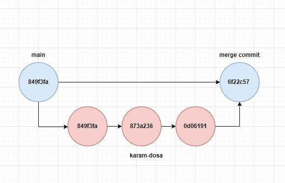

* echo "Hello world" | git hash-object --stdin --> prints sha code on the screen 
* git cat-file <commit-id> -p --> print the info about sha code
* git checkout -b --> create new branch and change the workspace into new branch
* git log --oneline

Merging
--------
1. create another branch
2. do the changes in that branch
3. raise PR (pull request)
4. get the approval
5. then merge it 

Merge gives us a new merge which has 2 parents, we can clearly see the history.

Rebase
-----------

