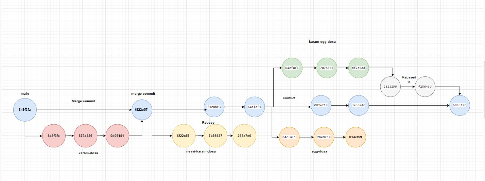

* echo "Hello world" | git hash-object --stdin --> prints sha code on the screen 
* git cat-file <commit-id> -p --> print the info about sha code
* git checkout -b <branch-name> --> create new branch and change the workspace into new branch
* git log --oneline
* git checkout main ---> to move from another branch to main
* git rebase main --> when conflict araises pull main branch and do rebase to see what are the changes conflicting
* git rebase --continue ---> to see next changes. do necessary changes and commit.

Merging
--------
1. create another branch
2. do the changes in that branch
3. raise PR (pull request)
4. get the approval
5. then merge it 

Merge gives us a new merge commit which has 2 parents, we can clearly see the history.

Rebase
-----------
rebase --> change the base
no extra commit
commit id are changed
no history is preserved, it is rewritten as if it is done in main branch
looks clean, linear history

single branch --> multiple persons are working --> prefer merge
if you want to keep the history --> prefer merge
blindly go for merge, if you are not sure

single branch --> single person --> prefer rebase
if you dont want history --> prefer rebase
if you want clean structure --> prefer rebase

conflicts
----------------
if git findsout 2 different content in the same line, it cant take decission. people who wrote the code should sit together and resolve conflict

if main branch is moved forward
another branch is trying to merge the changes, then conflict will come

